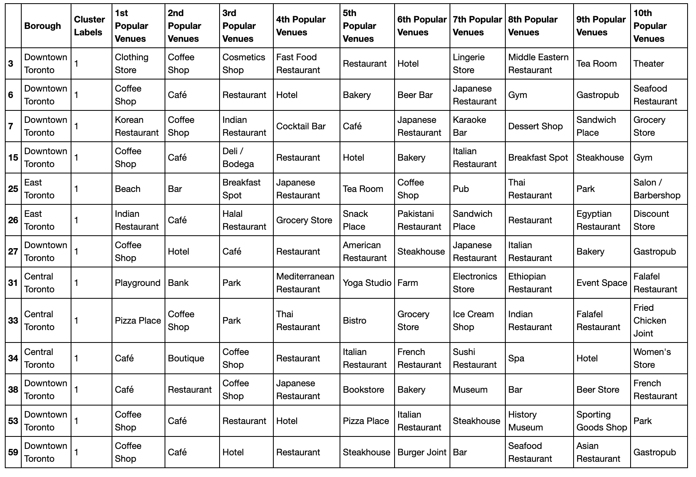

# Peer-graded Assignment: Capstone Project - The Battle of Neighborhoods

Presentation: https://docs.google.com/presentation/d/1kLAEgKk5GmNqW0RPGivVDdGGKvbZdsIgrwjL29d7MWU/edit#slide=id.p

## Introduction
In this project we will try to find an optimal location for a restaurant. Specifically, this report will be targeted to stakeholders interested in opening an restaurant in Toronto, Canada.

Here we will try finding if someone wants to open a new restaurant in the city which location is best suited for it keeping in mind the competitors and which income group of people will be attracted most to it based on the population of the neighbourhood.

Since there are lots of restaurants in Toronto we will try to detect locations that are not already crowded with restaurants. We would also prefer locations as close to city center as possible, assuming that first two conditions are met.

We will use our data science powers to generate a few most promissing neighborhoods based on this criteria. Advantages of each area will then be clearly expressed so that best possible final location can be chosen by stakeholders.

## Data
Based on definition of our problem, factors that will influence our decission are:

All existing restaurants in the neighborhood (any type of restaurant)
Age group of people with their income
Distance of neighborhood from city center
We decided to use regularly spaced grid of locations, centered around city center, to define our neighborhoods.

Following data sources will be needed to extract/generate the required information:

centers of candidate areas will be generated algorithmically and approximate addresses of centers of those areas will be obtained using https://en.wikipedia.org/wiki/List_of_postal_codes_of_Canada:_M
number of restaurants and their type and location in every neighborhood will be obtained using Foursquare API

## Results

## Analysis 
**Data identifiaction, capturing and cleaning.**
Search & Identify the relavant data source and capture it, here we are using wikipedia to get data about Toronto, Canada. Then we remove all the redundant value(data cleaning). Then we combine neighborhood similar Bronx. Now the data is clean and ready to use.

**Combining different data source and sorting neighborhood based on Longitude and latitude**
Now, we will combine neighborhood dataset with postal address and dataset with Latitude & Longitude and save them it separate data frame.The resultant data frame with contain details aabout Postal code, Brough, Neighborhood, Latitude & Longitude.Then visualize it using folium map.

**Explore the Toronto's neighborhoods**
Firstly, we explored all the neighborhoods in the city of Toronto, using the Latitude & Longitude data, using Foresquare API to get the Restaurant venues available in Toronto.Explore the unique categories in the neighborhood.Filter the Venues details for all possible ‘Restaurants’. Find each neighborhood along with the top most common venues.Identify the top 10 venues for each neighborhood.

**Clustering**
With an assumption of 5 clusters, use K-Cluster algorithm to come up with 5 different clusters in Toronto with similar set of Venues.Explore each cluster and determine the discriminating venue categories that distinguish each cluster. Identify the clusters & Boroughs/Neighborhoods with Maximum number restaurants and their types.

## Discussion section
Our analysis shows that although there is a great number of restaurants in Toronto, there are pockets of low restaurant density fairly close to city center.We have 4 boroughs and 74 neighborhoods inside geograpical coordinate of 43.653963, -79.387207.

Based on our initial assumption of the cluster with maximum number of restaurants will have the best possibility to have a new restaurant due to the need in the area. Based on the resultant clusters it looks like Cluster 1 and Cluster 5 have higher number of resturants then rest of the clusters.

It is entirely possible that there is a very good reason for small number of restaurants in any of those areas, reasons which would make them unsuitable for a new restaurant regardless of lack of competition in the area. Recommended zones should therefore be considered only as a starting point for more detailed analysis which could eventually result in location which has not only no nearby competition but also other factors taken into account and all other relevant conditions met.

## Conclusion
Purpose of this project was to identify areas n Toronto with low number of restaurants in order to aid stakeholders in narrowing down the search for optimal location for a new restaurant. By calculating restaurant density distribution from Foursquare data we have first identified general boroughs that justify further analysis, and then generated extensive collection of locations which satisfy some basic requirements regarding existing nearby restaurants. Clustering of those locations was then performed in order to create major zones of interest (containing greatest number of potential locations) and addresses of those zone centers were created to be used as starting points for final exploration by stakeholders.

Final decission on optimal restaurant location will be made by stakeholders based on specific characteristics of neighborhoods and locations in every recommended zone, taking into consideration additional factors like attractiveness of each location (proximity to park or water), levels of noise / proximity to major roads, real estate availability, prices, social and economic dynamics of every neighborhood etc.